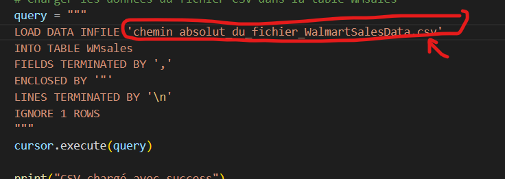

# Un exemple SQL avec Python

## Description
Connectez-vous au serveur SQL via un script python, créez une table à partir d'un fichier csv et sélectionnez les informations de la table.

## Etapes

### SQL server

1. Télécharger le programme d'installation de MySQL https://dev.mysql.com/downloads/installer/
 

2. Procédez à l'installation (paramètres par défaut) et choisissez un mot de passe root
 

3. Installez MySQL Workbench à partir de https://dev.mysql.com/downloads/workbench/ (laisser les paramètres par défaut)

4. Lancez MySQL Workbench puis démarrez la connexion root (tapez le mot de passe que vous avez créé lors de l'installation)
 

5. Vérifiez que le serveur SQL est activé (lancez PowerShell et exécutez la commande suivante: ***Get-service -Name 'mysql*' ***) \
Output:
 

6. De retour à MySQL Workbench, créez un nouveau schéma nommé ***walmart***
 
 

7. Enlevez les restrictions pour charger des données à partir d'un fichier CSV
    - Vérifiez le chemin du fichier my.ini 
     

    - Ouvrez Notepad en tant qu'administrateur, puis sélectionnez File>Open 
    - Collez le chemin du fichier my.ini dans l'explorateur de fichiers et ouvrez-le 
    - Supprimez la restriction en affectant à la variable ***secure-file-priv*** une chaîne vide: ***secure-file-priv=""*** 
    - Redémarrez la connexion root

8. Installez ODBC Driver for SQL Server https://docs.devart.com/odbc/mysql/windows.htm

### Python

1. Accédez à un répertoire de travail de votre choix, ouvrez cmd dans ce répertoire et clonez le repository en exécutant la ligne de commande suivante : ***git clone https://github.com/Sinda271/Un_exemple_SQL_avec_python.git ***

2. Accédez au dossier du repository: ***cd SQL_example_with_python***

3. Ouvrez vscode en exécutant: ***code .*** (pour ceux qui n'ont pas vscode, installez-le. C'est très simple et léger)

4. Fermez le cmd et ouvrez un terminal dans vscode 
 
 

5. Créez un environnement virtuel Python en exécutant la ligne de commande suivante: ***python -m venv env*** 

6. Activez l'environnement virtuel en exécutant la ligne de commande suivante: ***.\env\Scripts\activate***

7. Installez les librairies requises en exécutant la ligne de commande suivante: ***pip install -r requirements.txt***

8. Ouvrez ***TPsql.py*** et remplacez votre mot de passe dans les paramètres de connexion  
 

9. Remplacer le chemin du fichier CSV
 

10. Dans le terminal exécutez: ***python .\TPsql.py *** 

